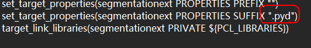
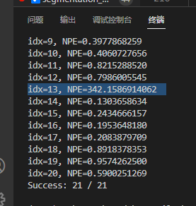
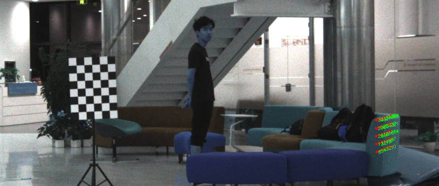

# mayavi
https://zhuanlan.zhihu.com/p/385308168

# pcl-python
不要装这个，换成open3d

# segmentation_ext can't be import
~~直接转化成python语言的函数~~

修改CMakeLists 中的settarget，如下图

直接放入当前文件夹 import

# 个别图像标定误差较大

 

想办法检测出 NPE > 10 的数据，剔除掉，重新标定